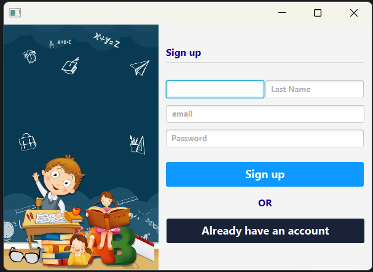
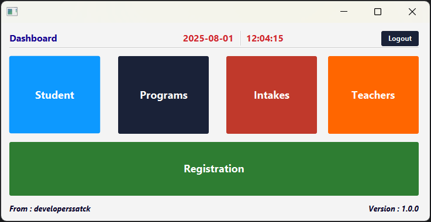
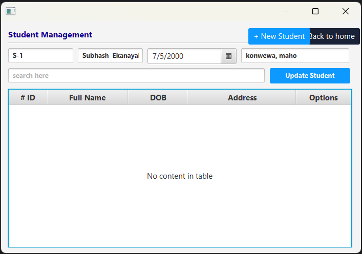
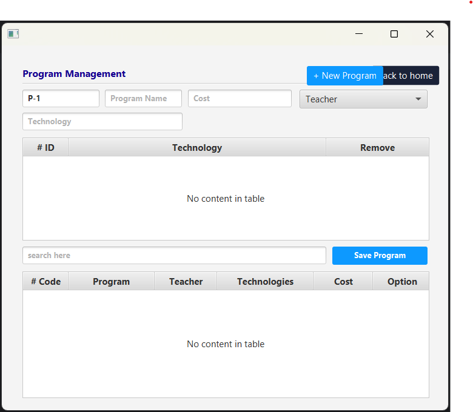
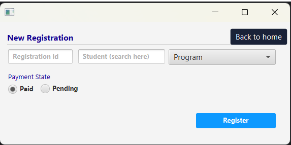

# 🎓 SmartAcademia - Student Management System

**SmartAcademia** is a desktop-based **Student Management System** developed using **JavaFX**, **MySQL**, and **JDBC**. The system provides an intuitive interface to manage students, teachers, academic programs, intakes, and registrations efficiently. It supports user registration, login authentication, and separate dashboards for different academic modules.

## Technologies Used

- **Java** – Core programming language used for backend logic  
- **JavaFX** – for building the graphical user interface (GUI)  
- **JDBC** – to connect the application with the database  
- **MySQL** – for data storage and management  
- **Scene Builder** – for designing JavaFX UI

## Features

- **User Registration and Login**  
  - New users can register by entering first name, last name, email, and password  
  - Registered users can log in securely using their email and password

- **Student Management**  
  - Add, view, update, and delete student records  

- **Teacher Management**  
  - Manage teacher information in a dedicated interface  

- **Program & Intake Management**  
  - Create and manage academic programs and intakes  

- **Registration Module**  
  - Register students to selected programs and track their enrollment

## Screenshots

### Login Page

### 📝 Signup Page

### 🏠 Dashboard

### 🎓 Student Management

### 📘 Program Management

### 📥 Registration Page

